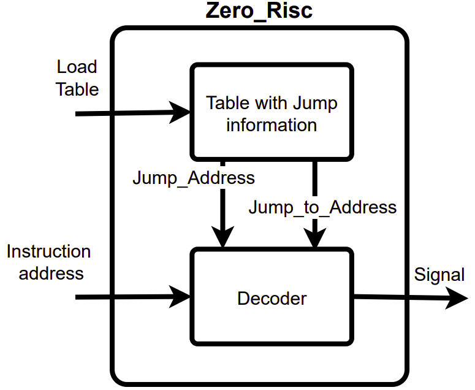

# Zero_Risc

Zero Risc is a securuty driven hardware module writen in Verilog. This module implemntes a CFI .........

This project emerged from a college proposed project topic, wich itself came from the *RISC-V Soft CPU Security Contest by Thales and Microchip Technology*
https://github.com/ThalesGroup/RISC-V-IoT-Contest

## Problem Statement

## Design

### Table - CFG
Zero_Risc Control flow graph is represent using a table that stores information about the *jump* intructions and the adress to wjere that *jump* can branch.

### Decoder
The decoder submodule is responssible for

### Zero_Risc module

### Tipical system overview

## User Guide

Currently, Zero Risc works as a proof of concept. This means that for it to work you need to hardcode the table before deploying it to the FPGA.

This module can be used simply by adding it to your project a submodule. Then you need just to connect:
  * **i_clk** to provide a clock 
  * **i_rst** as reset (synchornous positive reset)
  * **i_instr_addr**  to the Instruction Address (PC) register
  * **o_signal** to an IRQ of your system, and write your interrupt responce routine

## Usage
Zero Risc rsourse usage (using 16 entry CFG table

| **Resource Name** | **Zero Risc** | **Ibex** | **Relative Utilization**|
| ---- |:---:| ---- | ---- |
| Slice LUTs | 41 | 2557| 1.57|
|Slice Registers| 92| 996| 8,46|
|Slice| 29| 801| 3,49|
|LUT as Logic| 41| 2509| 1,60|
|F7 Muxes| 0| 2| 0|
|LUT as Memory| 0| 48| 0|
|Block Ram Tile| 0| 16| 0|
|DSPs| 0| 1| 0|
|Bonded IOB| 0| 31| 0|
|BUFGCTRL| 0| 4| 0|
|PLLE2_ADV| 0| 1| 0|

## The Repository is organized as follows:

  [Verilog](verilog) - HDL for the Zero Risc module

  [Sim](sim) - HDL for the Zero Risc module simulation

  [Ibex](ibex) - Link to the Ibex repository  

### To do
* Loader module to load the CFG table. This is currently being done by hardcoding in the *Verilog* code  
l
